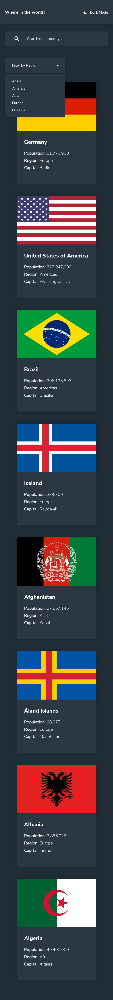

# World Country Explorer

O **World Country Explorer** é um projeto que permite aos usuários explorar informações de diferentes países ao redor do mundo. Com esta aplicação, você pode visualizar detalhes básicos de cada país, como bandeira, população, idiomas, moedas, região, capital e países vizinhos.

## Funcionalidades

- Visualizar detalhes básicos e avançados de cada país, incluindo bandeira, população, idiomas, moedas, região, capital e etc.
- Filtrar países por região (continente) para facilitar a pesquisa.
- Pesquisar países por nome para localizar informações específicas.
- Tema claro/escuro, permitindo alternar entre os modos de exibição.

## Como usar

Acesse o projeto hospedado em [GitHub Pages](https://rafael-vas.github.io/world-country-explorer/).

Na página do projeto, você encontrará uma lista de países com suas respectivas informações básicas. Você pode usar as seguintes funcionalidades:

- Filtrar por região: No menu suspenso "Filter by Region", selecione a região desejada para ver apenas os países pertencentes a essa região.
- Pesquisar por nome: Na barra de pesquisa no canto superior direito, insira o nome de um país para encontrar informações específicas sobre ele.
- Visualizar mais detalhes: Clique em cada card de país para ver informações adicionais, como sub-região, idiomas, moedas e países vizinhos.
- Alternar tema: Clique no botão "Theme" para alternar entre o modo claro e escuro da aplicação.

## Tecnologias utilizadas

- HTML5, CSS3 e JavaScript: Para a estruturação, estilo e funcionalidade da aplicação.
- REST Countries API: Para obter dados detalhados sobre os países de todo o mundo.

### Link

```
https://rafael-vas.github.io/world-country-explorer/
```

### Screenshot

#### Desktop


#### Mobile



## Créditos

Este projeto foi desenvolvido por [Rafael Vasconcelos](https://github.com/rafael-vas).

## Contribuição

Se você quiser contribuir com este projeto, fique à vontade para fazer um fork e enviar um pull request com suas melhorias.
